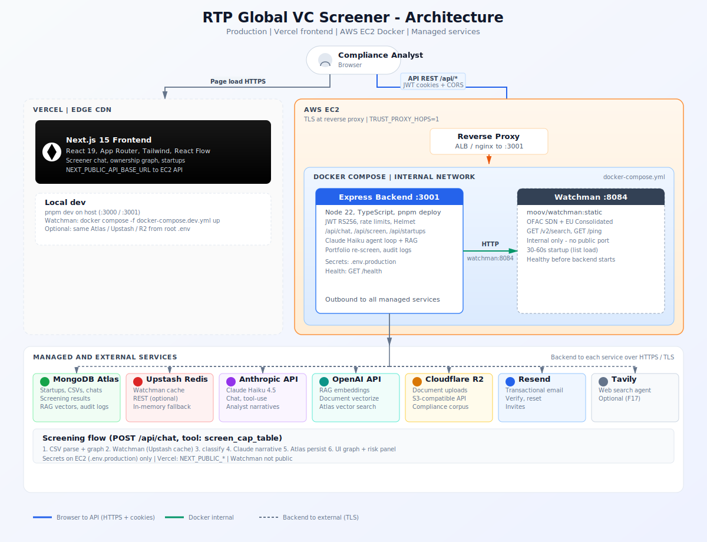

# RTP Global — VC Sanctions & Cap-Table Screener

A decision-support tool for venture firms. Upload a startup cap table (CSV), screen every owner (including UBOs behind shell-company layers) against OFAC/EU sanctions lists, and get a plain-English risk report with ownership graph, entity table, and Claude-generated analyst notes.

**It never decides guilt.** It narrows the review set for a human compliance officer.

---

## Architecture

Production stack: **Vercel** hosts the Next.js UI; **AWS EC2** runs the Express API and Watchman in Docker; managed services handle data, cache, storage, and LLMs.



| Layer | Where | Role |
|-------|--------|------|
| **Frontend** | [Vercel](https://vercel.com) | Next.js 15, React 19, Tailwind, React Flow — cap-table upload, screening UI, assistant chat |
| **Backend API** | AWS EC2 (Docker) | Express + TypeScript (`:3001`) — auth, screening orchestration, agentic chat |
| **Watchman** | AWS EC2 (Docker, internal) | OFAC SDN + EU Consolidated sanctions matching |
| **MongoDB** | Atlas | Startups, CSVs, chats, screening results, tabular reviews |
| **Cache** | Upstash Redis | Optional Watchman result cache |
| **Storage** | Cloudflare R2 | Document uploads |
| **LLM** | Anthropic (Haiku) | Analyst narratives + tool-use chat |

**Browser → API:** HTTPS from Vercel to EC2; JWT auth via httpOnly cookies; CORS locked to `FRONTEND_URL`.

**Screening path:** CSV → ownership graph → Watchman search → risk classification → Claude narrative → graph + risk table in the UI.

Full topology, request flows, env split, and deploy checklist: **[docs/ARCHITECTURE.md](docs/ARCHITECTURE.md)** · editable SVG: **[docs/architecture-diagram.svg](docs/architecture-diagram.svg)**

---

## Local development

### 1. Watchman (sanctions lists)

```bash
docker compose -f docker-compose.dev.yml up
# Wait ~30–60 s for SDN/EU lists to load
```

### 2. Environment & dev server

```bash
cp .env.example .env
# Edit .env: ANTHROPIC_API_KEY, MONGODB_URI, JWT keys, etc.
pnpm install
pnpm dev    # backend :3001 + frontend :3000
```

| Variable | Local default |
|----------|---------------|
| `NEXT_PUBLIC_API_BASE_URL` | `http://localhost:3001` |
| `FRONTEND_URL` | `http://localhost:3000` |
| `WATCHMAN_URL` | `http://localhost:8084` |
| `MONGODB_URI` | `mongodb://localhost:27017/vc-screener` or Atlas |

**Preview mode** (no auth): set `ALLOW_PREVIEW_MODE=true` and `NEXT_PUBLIC_ALLOW_PREVIEW_MODE=true` in `.env` — local only.

### 3. Individual services

```bash
pnpm --filter vc-screener-backend dev
pnpm --filter rtp-global dev
```

---

## Production deploy

**EC2** — backend + Watchman:

```bash
cp .env.example .env.production   # fill all secrets; never commit
docker compose --env-file .env.production up -d --build
```

**Vercel** — frontend: deploy `frontend/`, set `NEXT_PUBLIC_API_BASE_URL` to your EC2 (or ALB) URL. Set `FRONTEND_URL` on the backend to your Vercel URL for CORS.

See [docs/ARCHITECTURE.md](docs/ARCHITECTURE.md) for the full checklist.

---

## Screening flow

1. Parse CSV → ownership records (strict format, column aliases, or Claude schema inference)
2. Build directed ownership graph ([graphology](https://graphology.github.io/))
3. Traverse chains (BFS) to surface ultimate beneficial owners
4. Screen each node via [Watchman](https://github.com/moov-io/watchman) — `GET /v2/search`
5. Classify: **clear** (&lt;0.80) / **review** (0.80–0.95) / **flagged** (≥0.95)
6. Claude Haiku writes who/why/confidence/next-step narratives for review + flagged entities

Agentic chat (`POST /api/chat`) wraps screening in tool-use so users can ask follow-ups against stored results.

---

## CSV format

```csv
entity,entity_type,owner,owner_type,ownership_pct
NexaFlow AI Inc,company,Emma Richardson,person,18
Cascade Series A SPV LLC,company,Meridian Offshore Holdings Ltd,company,100
Ashford Family Trust,company,Ivan Petrovich Kozlov,person,100
```

**Demo dataset:** `backend/sample-data/sample-cap-table.csv` — Series A due-diligence scenario with clean, review, flagged, deep-chain UBO, and circular-ownership cases. See `backend/sample-data/DEMO.md` for the full walkthrough.

---

## Commands

```bash
pnpm install
pnpm dev
pnpm -w run typecheck
pnpm -w run lint

# Production Docker (on EC2)
docker compose --env-file .env.production up -d --build

# Local Watchman only
docker compose -f docker-compose.dev.yml up
```

---

## Docs for contributors

- **[docs/ARCHITECTURE.md](docs/ARCHITECTURE.md)** — deployment topology, Docker, env split
- **[CLAUDE.md](CLAUDE.md)** — source map, routes, AI assistant conventions
- **[.claude/PROJECT.md](.claude/PROJECT.md)** — platform capabilities and custom agents
